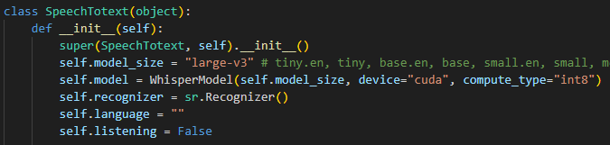
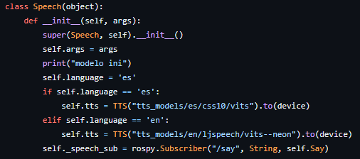
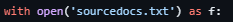
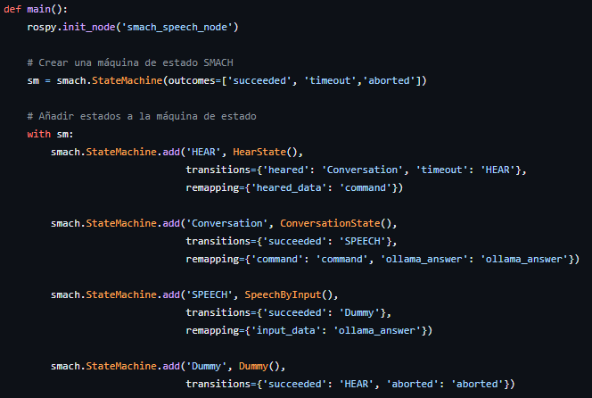
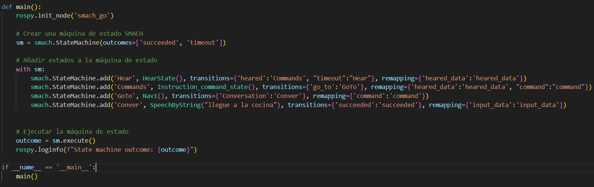

# uchile_HR_interface

# Guía de instalación 

## Modelo speech to text

FasterWhisper es una librería *Speech to Text* que reimplementa el modelo Whisper de OpenAI. Su principal característica es su gran velocidad a la hora de convertir texto en audio (Se necesita GPU para aprovechar esta característica).

### Requerimientos Faster-Whisper

- Se requiere Python 3.8 o superior
- Instalar cuBLAS: [https://developer.nvidia.com/cublas](https://developer.nvidia.com/cublas)
- Instalar cuDNN: [https://developer.nvidia.com/cudnn](https://developer.nvidia.com/cudnn)

### Instalación Faster-Whisper

Para instalar ambas librerías se deben seguir los pasos indicados en el siguiente enlace:

[https://medium.com/geekculture/install-cuda-and-cudnn-on-windows-linux-52d1501a8805](https://medium.com/geekculture/install-cuda-and-cudnn-on-windows-linux-52d1501a8805)

Para más información sobre la instalación y la utilización de la librería, visitar el GitHub de Faster-Whisper:

[https://github.com/SYSTRAN/faster-whisper?tab=readme-ov-file](https://github.com/SYSTRAN/faster-whisper?tab=readme-ov-file)

## Modelo text to speech

CoquiTTS es una librería "Text to Speech" que proporciona modelos avanzados de síntesis de voz. Se puede utilizar mediante CPU como GPU.

### Requerimientos CoquiTTS

- Se necesita Python >= 3.9, < 3.12.

### Instalación CoquiTTS

Para la instalación de la librería CoquiTTS y sintetizar la voz utilizando los modelos proporcionados por Coqui, se debe ejecutar el siguiente comando:

- `pip install TTS`

Para más información en la implementación y desarrollo de otros modelos, consultar a:

- [https://docs.coqui.ai/en/latest/models/xtts.html](https://docs.coqui.ai/en/latest/models/xtts.html)

Si después upgradear python, la terminal deja de funcionar, se hará necesario utlizar alguno de estos comandos para mantener python3.8 como motor del sistema. Los siguientes comandos pueden ser de utilidad:

```
sudo update-alternatives --install /usr/bin/python3 python3 /usr/bin/python3.8 1

sudo nano /usr/bin/gnome-terminal

change #!/usr/bin/python3.9 to #!/usr/bin/python3 

sudo update-alternatives --config python3

and then select python3.8
```

## Modelo NLP

El NLP que utiliza el proyecto trabaja con contexto, por lo cual opera en conjunto con una base de datos vectorial. En esta sección se destacan dos componentes importantes:

**ChromaDB:** Base de datos vectorial usada por su sencillez al trabajar con LLMs.

**Ollama:** API de Meta que facilita la descarga, configuración, entre otros de LLMs.

### Requerimientos

- Python 3.8 o superior
- GPU para mejor rendimiento

### Instalación

**ChromaDB:** Se puede instalar con el comando: `pip install chromadb`.

*Notar que requiere una versión de SQLite mayor a 3.35. En caso de cualquier inconveniente consultar en: [https://docs.trychroma.com/troubleshooting](https://docs.trychroma.com/troubleshooting)*

**Ollama:** Las versiones de Windows, Linux y MacOS se encuentran en: [https://ollama.com/download](https://ollama.com/download) y en Ubuntu se puede utilizar `sudo apt install ollama`.

**Modelos en Ollama:** Después de correr nuestra API con `ollama serve`, podemos llamar modelos con el siguiente comando:

`Ollama pull <nombre del modelo>`

Para más comandos útiles, consultar: [https://medium.com/@sridevi17j/step-by-step-guide-setting-up-and-running-ollama-in-windows-macos-linux-a00f21164bf3](https://medium.com/@sridevi17j/step-by-step-guide-setting-up-and-running-ollama-in-windows-macos-linux-a00f21164bf3)

Una vez instalados los requisitos, basta con clonar el paquete de ROS con los archivos necesarios para el funcionamiento en un *catkin workspace* y compilarlo. El paquete se encuentra en: [https://github.com/uchile-robotics/uchile_hr_interface](https://github.com/uchile-robotics/uchile_hr_interface).

# Guía de uso 

## Modelo speech to text

El código implementado para utilizar FasterWhisper se encuentra en `Speech2Text.py`. Este código implementa la clase *SpeechToText* que inicializa el modelo FasterWhisper tal como se presenta a continuación:



Siendo `self.model` la variable que contiene al modelo con los parámetros correspondientes. De esta forma, utilizando el método *Hear* de la clase *SpeechToText*, el modelo escucha constantemente el entorno. En caso de oír alguna voz, transcribe el mensaje y lo publica en el nodo `recognized_speech`.

## Modelo text to speech

Existen dos tipos de modelos dentro de los que se encuentran al instalar CoquiTTS, los cuales pueden ser multilenguaje o trabajar con solo uno:

1. **Single Speaker**: Este corresponde a un modelo con solo un speaker (voz).
2. **Multi Speaker**: Este corresponde a un modelo que contiene más de un speaker.

### Implementación del Código



El código implementado para utilizar CoquiTTS se encuentra en `Text2Speech.py`. Este código implementa la clase *Speech* que inicializa el modelo CoquiTTS. En este código se utilizaron dos modelos **Single Speaker** los cuales son determinados según el lenguaje reconocido por el modelo **Speech To Text** nombrado anteriormente. Así, inicializa el nodo de ROS, crea una instancia de la clase `Speech` y mantiene el nodo en funcionamiento para recibir y procesar mensajes de texto. Este método convierte el texto recibido en audio utilizando CoquiTTS y guarda el audio generado en el archivo `output.wav`, para finalmente reproducirlo.

*Esto se debe a la velocidad del modelo utilizando CPU, el único método disponible al momento del desarrollo del código. Debido a ello, aunque se ejecuta en el menor tiempo posible, utiliza voces diferentes para español e inglés.*

## Modelo NLP

### Modificar LLMs:

Los modelos del proyecto son personalizables, por lo cual podemos referenciar los que queramos en el archivo llamado `config.ini`. Debemos usar un modelo de lenguaje y uno de embedding que es el que trabaja con la base de datos vectorial.

**Nota 1:** Se deben descargar los modelos desde la API de Ollama antes de correr los archivos.

**Nota 2:** Es necesario descargar e importar el archivo `utilities.py`, para que la configuración funcione correctamente.

### Guardar el contexto

**Importante:** Solo es necesario hacer este proceso la primera vez que se corre el proyecto, o cada vez que se modifiquen los archivos de contexto.

En un archivo separado, escribir una lista con los archivos que contienen el contexto con su extensión. En el proyecto la lista se hace en `sourcedocs.txt`, pero se puede modificar siempre que se cambie el directorio del archivo en la línea 30 de `write.py`, que es la siguiente:



Una vez hecho esto, escoger dónde se guardará la instancia de ChromaDB en la línea 21 y correr `write.py` para guardar el contexto en la base de datos.

### Consultas al NLP

Lo primero es indicar dónde se encuentra la instancia de la base de datos para que el modelo pueda sacar la información, en la línea 14 de `search.py`:


Una vez hecho esto, tendremos acceso a la clase `NLPProcessor` y mediante su función `process_query()` podremos realizar consultas al NLP.

## Funcionamiento General

Para utilizar la interfaz humano-robot de Bender, en primer lugar se debe correr el archivo `audio_perception.launch` mediante el comando `roslaunch`. Este archivo ejecuta los códigos `Text2Speech.py` y `Speech2Text.py`, de esta forma los modelos text-to-speech y speech-to-text estarán corriendo en paralelo.

Por una parte, la máquina de estado de conversación funciona con los siguientes estados:

1. `HearState`: Obtiene el mensaje escuchado en el tópico `recognized_speech` y lo guarda como información para el siguiente estado.
2. `ConversationState`: Recibe un input, lo procesa utilizando Ollama y retorna la respuesta del LLM como información para el siguiente estado.
3. `SpeechByInput`: Recibe información del estado anterior y la reproduce como Speech del robot.

A continuación, se muestra el código de los estados implementados:



Por otro lado, el archivo `go_by_command_sm_test.py` implementa las máquinas de estado para realizar la interfaz indicada. Las máquinas de estado son:

1. `HearState`: Obtiene el mensaje escuchado en el tópico `recognized_speech` y lo guarda como información para el siguiente estado.
2. `Instruction_command_state`: Recibe el mensaje escuchado de `HearState` y lo transforma a un comando específico mediante el modelo LLM.
3. `Nav1`: Recibe el comando específico de `Instruction_command_state` y dependiendo de la ubicación a la que haga referencia este comando (ej: Kitchen), el robot se desplazará a esa zona.
4. `SpeechByString`: El robot indica mediante voz que ha llegado a la zona especificada.

De esta forma, al ejecutar el archivo `go_by_command_sm_test.py`, el usuario puede indicarle por voz a Bender la ubicación específica a la cual quiere que este se desplace.

Si se quieren agregar otras ubicaciones o agregar más comandos, se debe modificar el contexto de Bender en el archivo indicado en la sección **Modelo NLP**.

A continuación, se presenta el flujo de los 4 estados indicados anteriormente:



Es importante notar que existen dos estados diferentes para sintetizar voz: `SpeechByInput`

